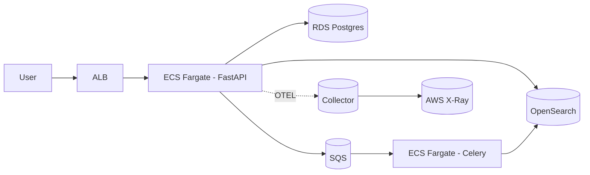

# Atlas Knowledge

Atlas Knowledge é um catálogo interno multi-tenant com busca full-text que consolida conhecimento institucional com governança forte. A plataforma foi pensada como um projeto vitrine de arquitetura moderna, resiliente e observável, combinando FastAPI, PostgreSQL, OpenSearch, processamento assíncrono com Celery/SQS e deploy completo em AWS.

## Visão geral

- **Observabilidade**: OpenTelemetry → ADOT → AWS X-Ray, CloudWatch Logs, métricas e alarmes.
- **Qualidade**: pytest (unit, integração, e2e), cobertura ≥ 85%, lint (ruff), mypy, pre-commit, Trivy e CodeQL.

### ✅ Entregue

- API FastAPI com autenticação JWT RS256, RBAC por organização e rotas principais (`/auth`, `/users`, `/docs`, `/search`) com _fallback_ para PostgreSQL.
- Frontend Vue 3 com login, busca, CRUD de documentos e detalhamento consumindo a API.
- Observabilidade base com logs estruturados (trace/span IDs), métricas Prometheus e _tracing_ inicial via OpenTelemetry.
  - Dashboard Grafana pronto (`infra/grafana/reindex-dashboard.json`) com visão operacional dos jobs/itens e tendências por hora.
- Ambiente local completo via `docker-compose` (Postgres, Redis, OpenSearch, Localstack, ADOT collector).
- Pipelines CI (lint, type-check, testes, Trivy, CodeQL) e suíte de testes unitários/integrados para API, worker e fluxo de documentos.
- Idempotência com Redis (`Idempotency-Key`), limites por rota com SlowAPI e cabeçalhos de segurança opinativos.
- Versionamento básico de documentos com histórico exposto em `GET /docs/{id}/versions`.
- Módulo Terraform de SQS com DLQ, SSE e alarmes CloudWatch para o pipeline de documentos.
- Módulo Terraform de VPC com IGW, NAT Gateway, sub-redes públicas/privadas multi-AZ configuráveis e rotas por zona.
  - NAT Gateway por AZ opcional: ambientes não críticos podem usar uma única saída compartilhada para reduzir custos.
- RDS PostgreSQL com subnet group privado, secret gerenciado no Secrets Manager e senha randômica gerada via Terraform.
- OpenSearch hospedado em sub-redes privadas, com TLS obrigatório, logs em CloudWatch e criptografia em trânsito/em repouso.
- Alarmes CloudWatch para saúde do OpenSearch (status, armazenamento, pressão JVM).
- Dashboard operacional no CloudWatch (`atlas-<env>-operations`) com métricas de SQS, ECS, RDS e OpenSearch.
- Alarmes adicionais no CloudWatch para CPU/memória do ECS (API, worker e frontend).
- Consultas CloudWatch Logs Insights versionadas (falhas do worker, erros 5xx e frontend) criadas via Terraform.
- Frontend Vue servindo via ECS Fargate atrás do ALB, com autoscaling baseado em CPU.
- Sidecar AWS Distro for OpenTelemetry nas tasks ECS (API/worker) exportando métricas e traces para a AWS.
- RDS com autoscaling de armazenamento (`max_allocated_storage`) e opção de Performance Insights por ambiente.
- AWS Budgets configurável por ambiente com alertas de custo (e-mail) controlados via Terraform.

### ⚠️ Pendências

| Status | Entrega | Observações |
| --- | --- | --- |
| 🚧 | UI Vue (login, busca, CRUD, dashboards) | Fluxos principais + painel de reindex entregues; dashboards analíticos e testes E2E pendentes. |
| ✅ | Observabilidade ponta a ponta | Tracing cross-service ativo (SQS → worker), dashboard + alarmes CloudWatch, queries Log Insights versionadas e evidências publicadas em `docs/observability.md`. |
| ✅ | Terraform com recursos reais | Infra estratificada com rotação automática do segredo RDS via Lambda gerenciada, otimizações de custo e observabilidade nativa. |
| ✅ | Deploy automatizado (GitHub Actions + Terraform) | Pipeline com planos/applies para dev/stage/prod, ambientes protegidos e redeploy ECS por ambiente. |
| 🚧 | Benchmarks Locust/wrk com métricas publicadas | Runner headless (`bench/run_headless.py`) e _smoke_ no PR (`locust-smoke`) prontos; falta executar cargas oficiais e anexar resultados consolidados. |

## Arquitetura



## Estrutura do repositório

```
atlas-knowledge/
├─ services/
│  ├─ api/              # FastAPI app + testes
│  ├─ worker/           # Celery worker
│  └─ frontend/         # Vue 3 + Pinia
├─ infra/
│  ├─ terraform/        # IaC (módulos + ambientes)
│  └─ docker-compose.yml# Ambiente local
├─ .github/workflows/   # Pipelines CI/CD
├─ scripts/             # Seeds, utilitários
├─ bench/               # Locust/wrk cenários
├─ tests/               # Suites transversais
├─ README.md            # Este documento
└─ SECURITY_CHECKLIST.md
```

## Como rodar localmente

1. Instale pré-requisitos: Docker, Docker Compose, Python 3.11+, Node 20+.
2. Copie `.env.example` para `.env` preenchendo variáveis mínimas.
3. Use o Makefile:

```bash
make bootstrap
make dev
```

4. Acesse:
   - API: http://localhost:8000/docs
   - Frontend: http://localhost:5173
   - OpenSearch Dashboards: http://localhost:5601

### Fluxo completo no frontend

1. **Login** — Utilize `admin@acme.com` / `admin`. As credenciais estão persistidas no banco com hash e a autenticação devolve _access token_ + _refresh token_.
2. **Dashboard** — Após autenticar você cai na tela de busca. Tudo é dinâmico:
  - A busca dispara `GET /search` e exibe os resultados tanto em cards quanto em um modal dedicado (com _snippet_ e tags).
  - Exceções da API disparam um modal de erro com feedback amigável.
  - Usuários `admin` ganham o botão **Novo documento**, que abre um modal com formulário para cadastrar runbooks/políticas via `POST /docs`.
  - Sucessos de criação apresentam um modal de confirmação e atualizam automaticamente a grade de resultados.
  - Um painel de reindexação mostra jobs recentes, progresso (pendentes/em andamento/concluídos/falhos) e permite disparar novas execuções e inspecionar itens.
3. **Detalhes** — Ao abrir um item, a rota `/docs/{id}` traz o conteúdo completo com contexto visual moderno (chips de tags, versão, data relativa e _skeleton loader_ durante o carregamento).

### Validando a API ponta a ponta

```powershell
# 1. Autentique-se e capture o token
$token = (Invoke-RestMethod -Method Post -Uri http://localhost:8000/auth/login -Body (@{ email = 'admin@acme.com'; password = 'admin' } | ConvertTo-Json) -ContentType 'application/json').access

# 2. Consulte o perfil autenticado
Invoke-RestMethod -Method Get -Uri 'http://localhost:8000/users/me' -Headers @{ Authorization = "Bearer $token" }

# 3. Busque documentos (com ou sem filtros de tags)
Invoke-RestMethod -Method Get -Uri 'http://localhost:8000/search?q=runbook&tags=incidentes' -Headers @{ Authorization = "Bearer $token" }

# 4. Crie um novo documento
Invoke-RestMethod -Method Post -Uri 'http://localhost:8000/docs' -Headers @{ Authorization = "Bearer $token" } -Body (@{ title = 'Checklist de DR'; body = 'Passo a passo de recuperação'; tags = @('dr','contingência') } | ConvertTo-Json) -ContentType 'application/json'
```

> Dica: também é possível explorar tudo via Swagger em http://localhost:8000/docs.

## Pipelines

- `pr.yml`: orquestra verificações paralelas antes do merge.
  - `lint-test`: instala dependências via Poetry, roda Ruff, MyPy e pytest (gera `coverage.xml` ≥ 85%).
  - `frontend`: instala deps Node 20, roda `npm run lint` e `npm run build` no SPA.
  - `security`: executa Trivy (fs scan) e CodeQL (init/analyze) para Python e JavaScript.
  - `locust-smoke`: sobe a stack Docker localmente, executa Locust headless por 1 minuto, falha se o tempo médio exceder 1.5s ou a taxa de falha passar de 1%, e publica CSVs + resumo em Markdown como artefato.
- `deploy.yml`: build/push imagens para ECR e executa Terraform plan/apply com approvals por ambiente (dev, stage, prod) antes de forçar novo deploy das services ECS.

## Observabilidade

- Logs JSON com structlog (campos: trace_id, span_id, route, org_id, user, status, latency).
- OpenTelemetry instrumentando FastAPI, SQLAlchemy, HTTP clients. Export via OTLP para collector.
- Middleware aplica `X-Request-ID` em todas as respostas e emite métricas Prometheus (`/metrics`).
- Dashboards CloudWatch: latência p95, erros 5xx, backlog SQS, métricas RDS, saúde do OpenSearch.
- Dashboard Grafana de reindex (`infra/grafana/reindex-dashboard.json`):
  1. Em Grafana, acesse **Dashboards > New > Import**.
  2. Cole o conteúdo do JSON ou selecione o arquivo local.
  3. Aponte para o datasource Prometheus usado no ambiente (ajuste o UID `PROM_DS` se necessário).
- Guia de observabilidade com screenshots e comandos: [`docs/observability.md`](docs/observability.md).
- Alertas Prometheus (`infra/otel/reindex-alert-rules.yaml`):
  1. Referencie o arquivo na configuração do alertmanager/prometheus (`rule_files`).
  2. Ajuste os rótulos `service`/`severity` conforme a taxonomia local.
  3. Defina rotas no Alertmanager para e-mails/Slack incidentais.
- TLS no ALB:
  1. Gere/import um certificado ACM válido (wildcard recomendado) na região configurada (`alb_certificate_arn`).
  2. Atualize `infra/terraform/envs/<env>/terraform.tfvars` com o ARN correto.
  3. Opcional: restrinja o acesso público ajustando `alb_allowed_cidrs`.
- Multi-AZ na VPC:
  1. Ajuste `vpc_az_count` em `infra/terraform/envs/<env>/terraform.tfvars` conforme as AZs desejadas.
  2. Certifique-se de que a região possui zonas suficientes e que os CIDRs disponíveis comportam os novos subnets.
  3. Cada AZ cria seu próprio NAT Gateway e route table privados; monitore custos ao aumentar a contagem.
  4. Use `vpc_nat_gateway_per_az = false` para ambientes onde um único NAT Gateway é suficiente (ex.: dev/stage).
- AWS Distro for OpenTelemetry no ECS:
  1. O sidecar é habilitado definindo `enable_otel_sidecar = true` no módulo ECS (já ativo nos ambientes provisionados).
  2. Ajuste `otel_collector_image` para _pin_ ou versões customizadas.
  3. Containers principais exportam via OTLP gRPC apontando para `http://127.0.0.1:4317`; mantenha essa configuração ao extender serviços.
- Integração ECS ↔ ALB:
  - API roda em Fargate com autoscaling (CPU target ≥ 60%).
  - Target group `atlas-<env>-api` recebe o tráfego HTTPS; paths definidos em `alb_frontend_path_patterns` podem ser roteados para workloads de frontend.

## Performance & Benchmarks

- Runner Locust headless (`bench/run_headless.py`) gera automaticamente CSVs, resumo Markdown e aplica guardrails de tempo médio/erro.
- Resultado de referência e checklist de execução: [`docs/performance.md`](docs/performance.md).
- Histórico versionado em CSV via `scripts/bench_append_history.py` (`docs/performance-history.csv`).

## Segurança

Confira a lista completa em [`SECURITY_CHECKLIST.md`](SECURITY_CHECKLIST.md). Destaques:

- JWT RS256, chaves em AWS Secrets Manager.
- Rate-limit e idempotência em mutações.
- IAM least privilege, SG fechados, HTTPS obrigatório, CORS estrito.
- SAST/DAST (CodeQL, Trivy), Dependabot, gitleaks.
- Backups RDS, testes de restauração, logs sem PII sensível.

## Roadmap atualizado

| Status | Entrega | Observações |
| --- | --- | --- |
| ✅ | Modelos SQLAlchemy + migrations iniciais | Dados base (usuários, organizações, documentos, memberships) prontos. |
| ✅ | Roteadores `auth`, `users`, `docs`, `search` com RBAC | Versionamento, reindex, idempotência e rate-limit entregues. |
| ✅ | Pipeline SQS → worker → OpenSearch | Indexação/deleção funcionando, reindex job com métricas/spans e consultas paginadas. |
| 🚧 | UI Vue (login, busca, CRUD, dashboards) | Fluxos principais + painel de reindex entregues; dashboards analíticos e testes E2E pendentes. |
| ✅ | Observabilidade ponta a ponta | Tracing, dashboards, alarmes e queries Log Insights versionadas; screenshots adicionadas à documentação. |
| ✅ | Terraform com recursos reais | Infra concluída com rotação automática de segredos, controles de custo e outputs para observabilidade. |
| ✅ | Deploy automatizado (GitHub Actions + Terraform) | Pipelines multiambiente com approvals e redeploy ECS automatizado. |
| 🚧 | Benchmarks Locust/wrk com métricas publicadas | Runner headless e artefatos automáticos prontos; aguarda execução oficial e publicação dos resultados reais. |
| ✅ | Screenshots/logs/dashboards no README | Evidências capturadas e linkadas em `docs/observability.md`. |

## Backlog priorizado para Product Ready

1. **Consolidar benchmarks oficiais**: executar cargas em stage/prod, anexar CSVs e análise comparativa ao repositório.
2. **UI e dashboards analíticos**: evoluir o frontend com painéis avançados e cobrir os fluxos com testes E2E.
3. **Guardrails de custos e capacidade**: configurar AWS Budgets, storage autoscaling e alarmes de limites críticos.
4. **Smoke tests automatizados**: acoplar `bench/run_headless.py` ao pipeline para validar releases antes do deploy.
5. **Hardening de segurança**: revisar checklist, aplicar pen tests leves e documentar respostas a incidentes.

## Créditos

Projeto idealizado para demonstrar arquitetura moderna, escalável e observável em um único monorepo, servindo como portfólio profissional.
