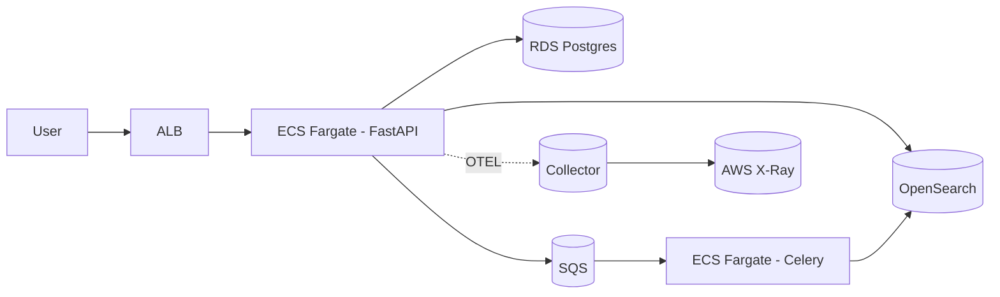

# Atlas Knowledge

Atlas Knowledge é um catálogo interno multi-tenant com busca full-text que consolida conhecimento institucional com governança forte. A plataforma foi pensada como um projeto vitrine de arquitetura moderna, resiliente e observável, combinando FastAPI, PostgreSQL, OpenSearch, processamento assíncrono com Celery/SQS e deploy completo em AWS.

## Proposta de valor

- **Reduz tempo de resposta** a incidentes críticos centralizando runbooks versionados e pesquisáveis em segundos.
- **Garante conformidade** com MFA obrigatório, WAF gerenciado e governança de acesso documentada.
- **Entrega observabilidade pronta** com dashboards, alertas e rastreamento distribuído para API e worker.
- **Facilita onboarding** através de guias públicos atualizados (`docs/onboarding.md`, `docs/api_reference.md`, `docs/tutorials/document-lifecycle.md`).

## Visão geral

- **Observabilidade**: OpenTelemetry → ADOT → AWS X-Ray, CloudWatch Logs, métricas e alarmes.
- **Qualidade**: pytest (unit, integração, e2e), cobertura ≥ 85%, lint (ruff), mypy, pre-commit, Trivy e CodeQL.

### ✅ Implementado e validado localmente

- API FastAPI com autenticação JWT RS256, revogação de tokens (`/auth/logout` com blacklist Redis), RBAC por organização e rotas principais (`/auth`, `/users`, `/docs`, `/search`) com _fallback_ para PostgreSQL.
- Frontend Vue 3 com login, busca, CRUD de documentos e detalhamento consumindo a API; fluxos exercitados no ambiente local.
- Observabilidade base com logs estruturados (trace/span IDs), métricas Prometheus e _tracing_ inicial via OpenTelemetry no stack Docker.
  - Dashboards Grafana são provisionados pelo Docker (`infra/grafana/dashboards/`) e exibem métricas do ambiente local após importação automática.
- Segurança básica: MFA TOTP habilitado para administradores seed, CORS restritivo configurável, mascaramento de PII nos logs (`LOG_MASK_FIELDS`) e dependências monitoradas por `pip-audit`/`npm audit`/Trivy no CI.
- Ambiente local completo via `docker compose` (Postgres, Redis, OpenSearch, Localstack, ADOT collector) com seeds de dados, incl. usuário admin e dois documentos de exemplo.
- Pipelines CI (lint, type-check, testes, Trivy, CodeQL) configurados para rodar em PRs; suíte de testes cobre API, worker e store de autenticação.
- Idempotência com Redis (`Idempotency-Key`), limites por rota com SlowAPI e cabeçalhos de segurança opinativos.
- Versionamento básico de documentos com histórico exposto em `GET /docs/{id}/versions`.
- Módulo Terraform de SQS com DLQ, SSE e alarmes CloudWatch para o pipeline de documentos.
- Módulo Terraform de VPC com IGW, NAT Gateway, sub-redes públicas/privadas multi-AZ configuráveis e rotas por zona.
  - NAT Gateway por AZ opcional: ambientes não críticos podem usar uma única saída compartilhada para reduzir custos.
- RDS PostgreSQL com subnet group privado, secret gerenciado no Secrets Manager e senha randômica gerada via Terraform.
- OpenSearch hospedado em sub-redes privadas, com TLS obrigatório, logs em CloudWatch e criptografia em trânsito/em repouso.
- Alarmes CloudWatch para saúde do OpenSearch (status, armazenamento, pressão JVM).
- Dashboard operacional no CloudWatch (`atlas-<env>-operations`) com métricas de SQS, ECS, RDS e OpenSearch.
- Alarmes adicionais no CloudWatch para CPU/memória do ECS (API, worker e frontend).
- Consultas CloudWatch Logs Insights versionadas (falhas do worker, erros 5xx e frontend) criadas via Terraform.
- Frontend Vue servindo via ECS Fargate atrás do ALB, com autoscaling baseado em CPU.
- Sidecar AWS Distro for OpenTelemetry nas tasks ECS (API/worker) exportando métricas e traces para a AWS.
- RDS com autoscaling de armazenamento (`max_allocated_storage`) e opção de Performance Insights por ambiente.
- AWS Budgets configurável por ambiente com alertas de custo (e-mail) controlados via Terraform.


### 🚧 Limitações conhecidas

- Seeds dependem do worker para chegarem ao OpenSearch; em ambientes sem fila ativa o fallback para PostgreSQL mantém a busca funcional, mas métricas de índice não refletem os dados até o worker consumir a fila.
- Observabilidade em AWS (CloudWatch dashboards, alertas e traces via ADOT) depende da aplicação dos módulos Terraform e ainda não possui evidências de execução real.
- WAF, Budgets, TLS via ACM e rotação automática de secrets exigem ativação explícita no Terraform e não foram comprovados em um ambiente gerenciado.
- O frontend carece de gestão de usuários, redefinição de senha, billing/go-to-market e automação E2E; estilos fora do dashboard principal ainda usam componentes básicos.
- Pipelines `deploy.yml` e jobs de bench não possuem execuções registradas; permissões e etapas manuais precisam ser revisadas antes de uma release pública.

### ⚠️ Pendências prioritárias

| Status | Entrega | Observações |
| --- | --- | --- |
| ⚠️ | UI Vue (login, busca, CRUD, dashboards) | Jornadas principais funcionam localmente, mas faltam cadastros administrativos, recuperação de senha, grafismos consistentes e cobertura E2E. |
| ⚠️ | Observabilidade ponta a ponta | Instrumentação OTel e dashboards Terraform existem, porém ainda não há evidência em ambiente AWS; alertas Prometheus/CloudWatch não estão conectados a canais reais. |
| ⚠️ | Terraform com recursos reais | Módulos prontos, mas dependem de parâmetros sensíveis (certificados ACM, budgets, alarm actions) e validação de apply/rollback. |
| ⚠️ | Deploy automatizado (GitHub Actions + Terraform) | Fluxo definido (`deploy.yml`), porém sem histórico de execuções; permissões AWS/GitHub e approvals precisam ser configurados. |
| ⚠️ | Benchmarks Locust/wrk com métricas publicadas | Apenas o benchmark local está registrado; falta rodar contra ambientes remotos e documentar comparação com SLOs. |

## Arquitetura



## Estrutura do repositório

```
atlas-knowledge/
├─ services/
│  ├─ api/              # FastAPI app + testes
│  ├─ worker/           # Celery worker
│  └─ frontend/         # Vue 3 + Pinia
├─ infra/
│  ├─ terraform/        # IaC (módulos + ambientes)
│  └─ docker-compose.yml# Ambiente local
├─ .github/workflows/   # Pipelines CI/CD
├─ scripts/             # Seeds, utilitários
├─ bench/               # Locust/wrk cenários
├─ tests/               # Suites transversais
├─ README.md            # Este documento
└─ SECURITY_CHECKLIST.md
```

## Como rodar localmente

1. Instale pré-requisitos: Docker, Docker Compose, Python 3.11+, Node 20+.
2. Copie `.env.example` para `.env` preenchendo variáveis mínimas.
3. Use o Makefile:

```bash
make bootstrap
make dev
```

4. Acesse:
   - API: http://localhost:8000/docs
   - Frontend: http://localhost:5173
   - OpenSearch Dashboards: http://localhost:5601
  - Prometheus: http://localhost:9090
  - Grafana: http://localhost:3000 (atlas/atlas)

5. Garanta que o pipeline de seeds → SQS → worker está saudável executando a suíte rápida:

```powershell
poetry run python scripts/validate_backend_flow.py
```

O comando roda os testes de bootstrap, fallback do `/search`, integração de seeds e retries do worker. Se precisar forçar uma reindexação manual, mantenha o fluxo documentado em `docs/backend_reindex_flow.md`.

## Documentação pública

- `docs/onboarding.md`: roteiro de habilitação com anotações sobre gaps atuais.
- `docs/api_reference.md`: referência detalhada de endpoints com exemplos de requisição e resposta.
- `docs/tutorials/document-lifecycle.md`: jornada guiada cobrindo login MFA, criação, edição e reindex (inclui nota sobre reindex manual).
- `docs/backend_reindex_flow.md`: arquitetura do pipeline API ↔ SQS ↔ worker, mecanismos de idempotência e script de validação.
- `docs/ux/validation_report.md`: registro das validações manuais e heurísticas aplicadas, com limitações documentadas.

### Fluxo completo no frontend

1. **Login** — Utilize `admin@acme.com` / `admin`. As credenciais estão persistidas no banco com hash e a autenticação devolve _access token_ + _refresh token_.
2. **Dashboard** — Após autenticar você cai na tela de busca:
  - A busca dispara `GET /search` e exibe os resultados em cards; lembre-se de rodar `/docs/reindex` após subir o ambiente para que os documentos seed apareçam.
  - Exceções da API disparam um modal de erro com feedback amigável.
  - Usuários `admin` ganham o botão **Novo documento**, que abre um modal com formulário para cadastrar runbooks/políticas via `POST /docs`.
  - Sucessos de criação apresentam um modal de confirmação e atualizam automaticamente a grade de resultados.
  - O painel de reindexação mostra jobs recentes, mas depende do worker/SQS estarem ativos; em modo dev ele executa inline pela API.
  - O atalho **Insights** leva à tela analítica com indicadores agregados retornados por `GET /docs/stats`.
3. **Detalhes** — Ao abrir um item, a rota `/docs/{id}` traz o conteúdo completo com contexto visual moderno (chips de tags, versão, data relativa e _skeleton loader_ durante o carregamento).

### Validando a API ponta a ponta

```powershell
# 1. Autentique-se e capture os tokens
$response = Invoke-RestMethod -Method Post -Uri http://localhost:8000/auth/login -Body (@{ email = 'admin@acme.com'; password = 'admin' } | ConvertTo-Json) -ContentType 'application/json'
$accessToken = $response.access
$refreshToken = $response.refresh

# 2. Consulte o perfil autenticado
Invoke-RestMethod -Method Get -Uri 'http://localhost:8000/users/me' -Headers @{ Authorization = "Bearer $accessToken" }

# 3. Busque documentos (com ou sem filtros de tags)
Invoke-RestMethod -Method Get -Uri 'http://localhost:8000/search?q=runbook&tags=incidentes' -Headers @{ Authorization = "Bearer $accessToken" }

# 4. Crie um novo documento
Invoke-RestMethod -Method Post -Uri 'http://localhost:8000/docs' -Headers @{ Authorization = "Bearer $accessToken" } -Body (@{ title = 'Checklist de DR'; body = 'Passo a passo de recuperação'; tags = @('dr','contingência') } | ConvertTo-Json) -ContentType 'application/json'

# 5. Finalize a sessão (revoga access/refresh e exige novo login)
Invoke-RestMethod -Method Post -Uri 'http://localhost:8000/auth/logout' -Headers @{ Authorization = "Bearer $accessToken" } -Body (@{ refresh = $refreshToken } | ConvertTo-Json) -ContentType 'application/json'
```

> Dica: também é possível explorar tudo via Swagger em http://localhost:8000/docs.

## Pipelines

- `pr.yml`: orquestra verificações paralelas antes do merge.
  - `lint-test`: instala dependências via Poetry, roda Ruff, MyPy e pytest (gera `coverage.xml` ≥ 85%).
  - `frontend`: instala deps Node 20, roda `npm run lint` e `npm run build` no SPA.
  - `security`: executa Trivy (fs scan) e CodeQL (init/analyze) para Python e JavaScript.
  - `locust-smoke`: sobe a stack Docker localmente, executa Locust headless por 1 minuto, falha se o tempo médio exceder 1.5s ou a taxa de falha passar de 1%, e publica CSVs + resumo em Markdown como artefato. O job de carga (`locust-smoke`) está configurado, mas exige Docker disponível no runner para funcionar.
- `deploy.yml`: build/push imagens para ECR e executa Terraform plan/apply com approvals por ambiente (dev, stage, prod) antes de forçar novo deploy das services ECS. Permissões AWS e variáveis de ambiente ainda precisam ser configuradas antes do primeiro uso.

## Observabilidade

- Logs JSON com structlog (campos: trace_id, span_id, route, org_id, user, status, latency).
- OpenTelemetry instrumentando FastAPI, SQLAlchemy, HTTP clients. Export via OTLP para collector.
- Middleware aplica `X-Request-ID` em todas as respostas e emite métricas Prometheus (`/metrics`).
- Dashboards CloudWatch: latência p95, erros 5xx, backlog SQS, métricas RDS, saúde do OpenSearch.
- Dashboards Grafana (`infra/grafana/dashboards/`):
  1. O `docker-compose` já monta os dashboards e o datasource `PROM_DS` automaticamente via `infra/grafana/provisioning`.
  2. Após `docker compose up`, acesse http://localhost:3000 (atlas/atlas) e navegue até **Dashboards → Atlas**.
  3. Dashboards incluídos: `Atlas Overview` (API/worker) e `Atlas Reindex` (pipeline de reindex detalhado).
- Guia de observabilidade com screenshots e comandos: [`docs/observability.md`](docs/observability.md).
- Alertas Prometheus (`infra/prometheus/rules/atlas-alerts.yml`):
  1. Já é carregado pelo Prometheus local; basta apontar o alertmanager de preferência.
  2. Ajuste os rótulos `service`/`severity` conforme a taxonomia local.
  3. Estende os alarmes críticos: erro 5xx elevado, latência p95, retries do worker e atraso de reindex.
- TLS no ALB:
  1. Gere/import um certificado ACM válido (wildcard recomendado) na região configurada (`alb_certificate_arn`).
  2. Atualize `infra/terraform/envs/<env>/terraform.tfvars` com o ARN correto.
  3. Opcional: restrinja o acesso público ajustando `alb_allowed_cidrs`.
- Multi-AZ na VPC:
  1. Ajuste `vpc_az_count` em `infra/terraform/envs/<env>/terraform.tfvars` conforme as AZs desejadas.
  2. Certifique-se de que a região possui zonas suficientes e que os CIDRs disponíveis comportam os novos subnets.
  3. Cada AZ cria seu próprio NAT Gateway e route table privados; monitore custos ao aumentar a contagem.
  4. Use `vpc_nat_gateway_per_az = false` para ambientes onde um único NAT Gateway é suficiente (ex.: dev/stage).
- AWS Distro for OpenTelemetry no ECS:
  1. O sidecar é habilitado definindo `enable_otel_sidecar = true` no módulo ECS (já ativo nos ambientes provisionados).
  2. Ajuste `otel_collector_image` para _pin_ ou versões customizadas.
  3. Containers principais exportam via OTLP gRPC apontando para `http://127.0.0.1:4317`; mantenha essa configuração ao extender serviços.
- Integração ECS ↔ ALB:
  - API roda em Fargate com autoscaling (CPU target ≥ 60%).
  - Target group `atlas-<env>-api` recebe o tráfego HTTPS; paths definidos em `alb_frontend_path_patterns` podem ser roteados para workloads de frontend.

## Performance & Benchmarks

- Runner Locust headless (`bench/run_headless.py`) gera automaticamente CSVs, resumo Markdown e aplica guardrails de tempo médio/erro.
- Por enquanto há apenas um ensaio local (`bench/results/local-official_summary.md`); testes contra ambientes remotos ainda não aconteceram.
- Utilize `scripts/bench_append_history.py` para versionar resultados reais assim que os ambientes forem disponibilizados.

## Segurança

Confira a lista completa em [`SECURITY_CHECKLIST.md`](SECURITY_CHECKLIST.md). Destaques:

- JWT RS256 e refresh tokens com blacklist Redis já operacionais em dev; chaves vivem em variáveis de ambiente e precisam ser migradas para Secrets Manager em produção.
- Rate-limit e idempotência ativos na API.
- MFA TOTP obrigatório para administradores seed; expansão para demais perfis depende de ajuste na base de usuários.
- Módulos Terraform cobrem WAF, SG, HTTPS e IAM, mas carecem de validação em ambiente provisionado.
- SAST/DAST (CodeQL, Trivy), Dependabot, pip-audit, npm audit e gitleaks prontos no CI.
- Políticas formais documentadas em [`docs/security`](docs/security); backups/testes de restauração devem ser executados antes da release.

## Roadmap atualizado

| Status | Entrega | Observações |
| --- | --- | --- |
| ✅ | Modelos SQLAlchemy + migrations iniciais | Dados base (usuários, organizações, documentos, memberships) prontos. |
| ✅ | Roteadores `auth`, `users`, `docs`, `search` com RBAC | Versionamento, reindex, idempotência e rate-limit entregues. |
| ✅ | Pipeline SQS → worker → OpenSearch | Indexação/deleção funcionando localmente; reindex executa inline se SQS/worker indisponíveis. |
| ⚠️ | UI Vue (login, busca, CRUD, dashboards) | Carece de testes E2E, cadastros administrativos e ajustes de UX fora do dashboard principal. |
| ⚠️ | Observabilidade ponta a ponta | Instrumentação pronta, mas resta validar dashboards/alertas em AWS. |
| ⚠️ | Terraform com recursos reais | Módulos completos, dependem de parâmetros reais e ensaios de apply/destroy. |
| ⚠️ | Deploy automatizado (GitHub Actions + Terraform) | Workflow criado, falta configurar secrets/roles e executar dry-runs. |
| ⚠️ | Benchmarks Locust/wrk com métricas publicadas | Apenas cenário local registrado; ambientes remotos ainda não testados. |
| ⚠️ | Screenshots/logs/dashboards no README | Capturas atuais são ilustrações; substituir por evidências reais após primeira execução em cloud. |

## Backlog priorizado para Product Ready

1. **UI e dashboards analíticos**: priorizar gráficos avançados, filtros dinâmicos e cobertura com testes E2E (login, criação/edição, analytics).
2. **Experiência do usuário**: adicionar notificações em tempo real, acessibilidade (ARIA) e internacionalização.
3. **Product readiness**: expandir catálogo de runbooks e automatizar exercícios trimestrais usando pipelines GitHub Actions.

## Créditos

Projeto idealizado para demonstrar arquitetura moderna, escalável e observável em um único monorepo, servindo como portfólio profissional.
