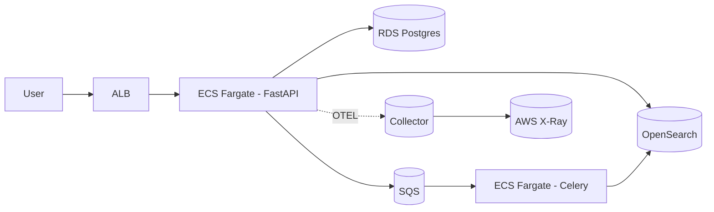

# Atlas Knowledge

Atlas Knowledge é um catálogo interno multi-tenant com busca full-text que consolida conhecimento institucional com governança forte. A plataforma foi pensada como um projeto vitrine de arquitetura moderna, resiliente e observável, combinando FastAPI, PostgreSQL, OpenSearch, processamento assíncrono com Celery/SQS e deploy completo em AWS.

## Visão geral

- **API**: FastAPI + SQLAlchemy + Alembic, autenticação JWT RS256, RBAC, idempotência via Redis e rate-limit nas mutações.
- **Worker**: Poller em Python consumindo SQS diretamente (boto3) para indexação no OpenSearch.
- **Frontend**: Vue 3 + Pinia + Vite consumindo a API.
- **Busca**: OpenSearch com analyzers PT/EN, sinônimos e filtros por tags, com _fallback_ automático para PostgreSQL.
- **Infraestrutura**: Terraform para VPC, ECS Fargate, RDS, OpenSearch, SQS, Secrets Manager, IAM OIDC.
- **Observabilidade**: OpenTelemetry → ADOT → AWS X-Ray, CloudWatch Logs, métricas e alarmes.
- **Qualidade**: pytest (unit, integração, e2e), cobertura ≥ 85%, lint (ruff), mypy, pre-commit, Trivy e CodeQL.

## Status do projeto

### ✅ Entregue

- API FastAPI com autenticação JWT RS256, RBAC por organização e rotas principais (`/auth`, `/users`, `/docs`, `/search`) com _fallback_ para PostgreSQL.
- Pipeline assíncrono com SQS + worker Python para indexar e remover documentos no OpenSearch.
- Frontend Vue 3 com login, busca, CRUD de documentos e detalhamento consumindo a API.
- Observabilidade base com logs estruturados (trace/span IDs), métricas Prometheus e _tracing_ inicial via OpenTelemetry.
- Ambiente local completo via `docker-compose` (Postgres, Redis, OpenSearch, Localstack, ADOT collector).
- Pipelines CI (lint, type-check, testes, Trivy, CodeQL) e suíte de testes unitários/integrados para API, worker e fluxo de documentos.
- Idempotência com Redis (`Idempotency-Key`), limites por rota com SlowAPI e cabeçalhos de segurança opinativos.

### ⚠️ Pendências

- Versionamento de documentos, endpoint `/reindex` e _replays_ completos para OpenSearch.
- Terraform com recursos reais (VPC com IGW/NAT, ALB HTTPS, Secrets Manager, autoscaling, DLQ SQS, sidecar ADOT).
- Pipeline de deploy GitHub Actions com _plan/apply_ por ambiente, imagens versionadas e aprovações.
- Dashboards/alertas CloudWatch, span/metrics do worker e publicação de screenshots/logs no README.
- Cenários de carga (Locust/wrk) e documentação dos resultados.

## Arquitetura



## Estrutura do repositório

```
atlas-knowledge/
├─ services/
│  ├─ api/              # FastAPI app + testes
│  ├─ worker/           # Celery worker
│  └─ frontend/         # Vue 3 + Pinia
├─ infra/
│  ├─ terraform/        # IaC (módulos + ambientes)
│  └─ docker-compose.yml# Ambiente local
├─ .github/workflows/   # Pipelines CI/CD
├─ scripts/             # Seeds, utilitários
├─ bench/               # Locust/wrk cenários
├─ tests/               # Suites transversais
├─ README.md            # Este documento
└─ SECURITY_CHECKLIST.md
```

## Como rodar localmente

1. Instale pré-requisitos: Docker, Docker Compose, Python 3.11+, Node 20+.
2. Copie `.env.example` para `.env` preenchendo variáveis mínimas.
3. Use o Makefile:

```bash
make bootstrap
make dev
```

4. Acesse:
   - API: http://localhost:8000/docs
   - Frontend: http://localhost:5173
   - OpenSearch Dashboards: http://localhost:5601

### Fluxo completo no frontend

1. **Login** — Utilize `admin@acme.com` / `admin`. As credenciais estão persistidas no banco com hash e a autenticação devolve _access token_ + _refresh token_.
2. **Dashboard** — Após autenticar você cai na tela de busca. Tudo é dinâmico:
  - A busca dispara `GET /search` e exibe os resultados tanto em cards quanto em um modal dedicado (com _snippet_ e tags).
  - Exceções da API disparam um modal de erro com feedback amigável.
  - Usuários `admin` ganham o botão **Novo documento**, que abre um modal com formulário para cadastrar runbooks/políticas via `POST /docs`.
  - Sucessos de criação apresentam um modal de confirmação e atualizam automaticamente a grade de resultados.
3. **Detalhes** — Ao abrir um item, a rota `/docs/{id}` traz o conteúdo completo com contexto visual moderno (chips de tags, versão, data relativa e _skeleton loader_ durante o carregamento).

### Validando a API ponta a ponta

```powershell
# 1. Autentique-se e capture o token
$token = (Invoke-RestMethod -Method Post -Uri http://localhost:8000/auth/login -Body (@{ email = 'admin@acme.com'; password = 'admin' } | ConvertTo-Json) -ContentType 'application/json').access

# 2. Consulte o perfil autenticado
Invoke-RestMethod -Method Get -Uri 'http://localhost:8000/users/me' -Headers @{ Authorization = "Bearer $token" }

# 3. Busque documentos (com ou sem filtros de tags)
Invoke-RestMethod -Method Get -Uri 'http://localhost:8000/search?q=runbook&tags=incidentes' -Headers @{ Authorization = "Bearer $token" }

# 4. Crie um novo documento
Invoke-RestMethod -Method Post -Uri 'http://localhost:8000/docs' -Headers @{ Authorization = "Bearer $token" } -Body (@{ title = 'Checklist de DR'; body = 'Passo a passo de recuperação'; tags = @('dr','contingência') } | ConvertTo-Json) -ContentType 'application/json'
```

> Dica: também é possível explorar tudo via Swagger em http://localhost:8000/docs.

## Pipelines

- `pr.yml`: lint (ruff), type-check (mypy), testes (pytest + coverage ≥ 85%), CodeQL, Trivy.
- `deploy.yml`: build/push imagens para ECR, Terraform plan/apply, ECS deploy (dev/prod).

## Observabilidade

- Logs JSON com structlog (campos: trace_id, span_id, route, org_id, user, status, latency).
- OpenTelemetry instrumentando FastAPI, SQLAlchemy, HTTP clients. Export via OTLP para collector.
- Middleware aplica `X-Request-ID` em todas as respostas e emite métricas Prometheus (`/metrics`).
- Dashboards CloudWatch: latência p95, erros 5xx, backlog SQS, métricas RDS, saúde do OpenSearch.

## Segurança

Confira a lista completa em [`SECURITY_CHECKLIST.md`](SECURITY_CHECKLIST.md). Destaques:

- JWT RS256, chaves em AWS Secrets Manager.
- Rate-limit e idempotência em mutações.
- IAM least privilege, SG fechados, HTTPS obrigatório, CORS estrito.
- SAST/DAST (CodeQL, Trivy), Dependabot, gitleaks.
- Backups RDS, testes de restauração, logs sem PII sensível.

## Roadmap atualizado

| Status | Entrega | Observações |
| --- | --- | --- |
| ✅ | Modelos SQLAlchemy + migrations iniciais | Dados base (usuários, organizações, documentos, memberships) prontos. |
| ✅ | Roteadores `auth`, `users`, `docs`, `search` com RBAC | Falta versionamento simples e idempotência. |
| ✅ | Pipeline SQS → worker → OpenSearch | Indexação/deleção funcionando; reindexação completa ainda ausente. |
| 🚧 | UI Vue (login, busca, CRUD, dashboards) | Fluxos principais entregues; dashboards analíticos e testes E2E pendentes. |
| 🚧 | Observabilidade ponta a ponta | Logs/metrics prontos; spans do worker, dashboards e alarmes a implementar. |
| 🚧 | Terraform com recursos reais | Módulos criados, mas ainda com placeholders (VPC, ALB, Secrets, autoscaling, DLQ). |
| 🚧 | Deploy automatizado (GitHub Actions + Terraform) | Workflow existente, mas depende de variáveis/infra reais e etapas de approval. |
| ⏳ | Benchmarks Locust/wrk com métricas publicadas | Scripts base criados, falta execução e análise. |
| ⏳ | Screenshots/logs/dashboards no README | Aguardando finalização das features de observabilidade. |

## Backlog priorizado para Product Ready

1. **Completar o pipeline de documentos**: versionamento simples, endpoint `/reindex`, replay paginado e instrumentação (traces/métricas) para API e worker.
2. **Madurar a infraestrutura Terraform**: VPC/rotas/IGW, ALB HTTPS, Secrets Manager, autoscaling ECS, DLQ SQS, sidecar ADOT e variáveis por ambiente.
3. **Evoluir o CI/CD**: images versionadas em ECR, Terraform plan/apply com aprovações, deploy por ambiente e parametrização de segredos.
4. **Observabilidade avançada**: dashboards e alertas CloudWatch, correlação logs→traces, métricas proativas e publicação de screenshots no README.
5. **Benchmarks e hardening final**: cenários Locust/wrk documentados, ajustes de performance, checklist de segurança concluído e testes E2E do frontend.

## Créditos

Projeto idealizado para demonstrar arquitetura moderna, escalável e observável em um único monorepo, servindo como portfólio profissional.
