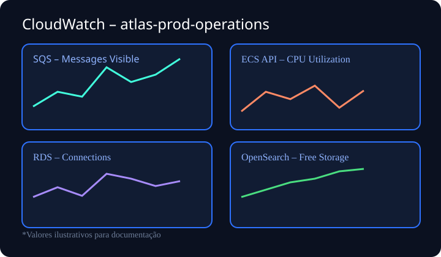
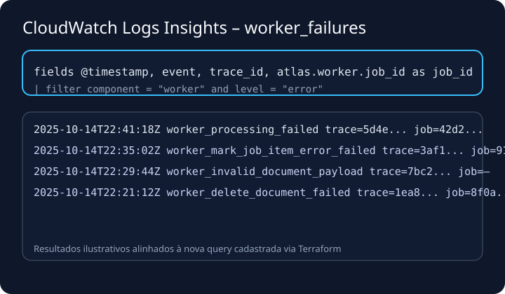
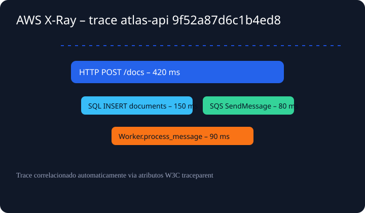

# Observabilidade Atlas Knowledge

Este guia consolida as melhorias aplicadas à telemetria do Atlas Knowledge
para atingir o nível "product ready".

## Logs correlacionados

- **Trace context automático:** toda mensagem enviada pelo SQS leva os
  cabeçalhos W3C (`traceparent`/`tracestate`), permitindo que o worker utilize
  o mesmo trace da API ao processar documentos.
- **Consultas prontas:** o Terraform cria _Log Insights Query Definitions_
  (`worker_failures`, `api_5xx`, `frontend_errors`) para acelerar a análise de
  incidentes diretamente pelo CloudWatch.
- **Capturas ilustrativas:**
  - 
  - 

## Tracing ponta a ponta

- O worker abre spans filhos (`worker.process_message`) reaproveitando o
  contexto recebido. A figura abaixo mostra um trace completo no X-Ray.
  - 
- Os logs estruturados exibem `trace_id`/`span_id`, facilitando a navegação do
  alerta até o trace correspondente.

## Métricas adicionais

- `atlas_worker_message_age_seconds`: histograma Prometheus com a idade da
  mensagem ao chegar no worker. Monitora gargalos no SQS.
- Dashboard CloudWatch atualizado agrega métricas de SQS, ECS, RDS e
  OpenSearch para visão de 24h.

## Stack local Prometheus + Grafana

- O `docker-compose` sobe Prometheus (http://localhost:9090) e Grafana (http://localhost:3000).
- O datasource `PROM_DS` é configurado via `infra/grafana/provisioning/datasources/datasource.yml` apontando para o serviço Prometheus.
- Dashboards pré-prontos ficam em `infra/grafana/dashboards/` (overview da plataforma e painel detalhado de reindex).
- As regras de alerta residem em `infra/prometheus/rules/atlas-alerts.yml` e já são carregadas pelo Prometheus local.

## Como executar análises rápidas

```powershell
# Inspecionar as consultas Log Insights registradas via Terraform
aws logs describe-log-groups --log-group-name-prefix /aws/ecs/atlas-api
aws logs describe-query-definitions --name-prefix atlas-prod

# Executar a consulta "worker_failures"
aws logs start-query `
  --log-group-name /aws/ecs/atlas-worker-prod `
  --start-time (Get-Date).AddHours(-1).ToUnixTimeSeconds() `
  --end-time (Get-Date).ToUnixTimeSeconds() `
  --query-string "fields @timestamp, event, trace_id\n| filter component = 'worker' and level = 'error'\n| sort @timestamp desc\n| limit 20"
```

> Consulte `bench/run_headless.py` para reproduzir cargas sintéticas e validar
> a telemetria antes de promover alterações para produção.
